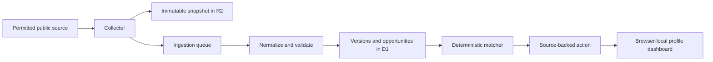

# Architecture

OpenAction is divided into a public web app, an edge API, and a reusable evidence core.

## Safety model

- The original source URL and retrieval time are mandatory on every action.
- Rules are deterministic. An optional model adapter may only extract or classify into an explicit schema; it cannot publish an unsourced action.
- Ingestion preserves snapshots and document versions. Failed source runs are recorded instead of silently ignored.
- The application provides informational guidance only. It does not determine legal, financial, or benefit eligibility.

## Runtime progression

The included demo uses local fixture collectors so it works without credentials. Production uses D1 for records, R2 for snapshots, Vectorize for evidence chunks, and Cron Triggers to enqueue permitted source refreshes. Every vector includes `sourceId`, `documentVersionId`, `ordinal`, `language`, and `status` metadata; Vectorize metadata indexes should be created for `sourceId`, `language`, and `status` before enabling semantic retrieval. Configure bindings from `apps/worker/wrangler.resources.example.jsonc` only after creating Cloudflare resources.
